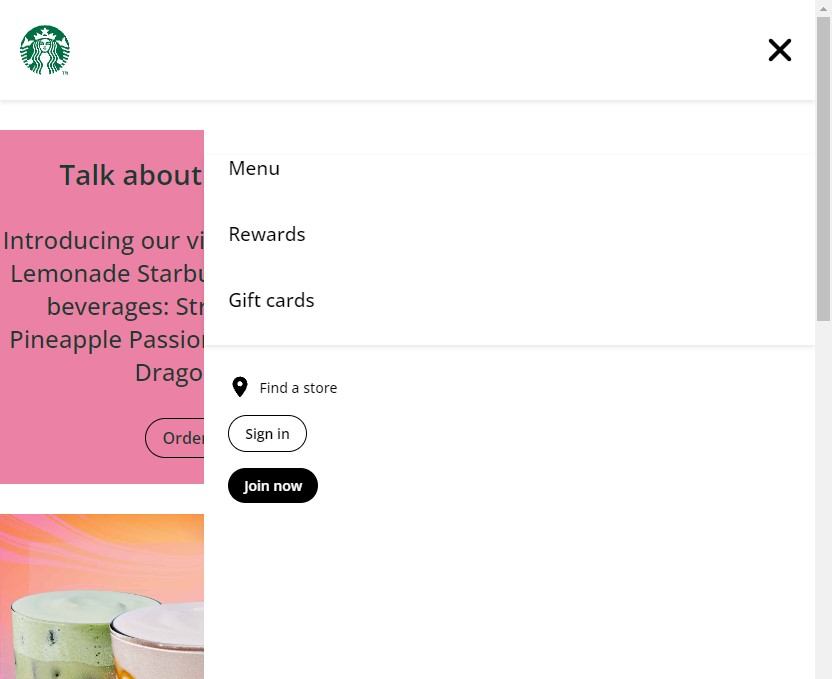
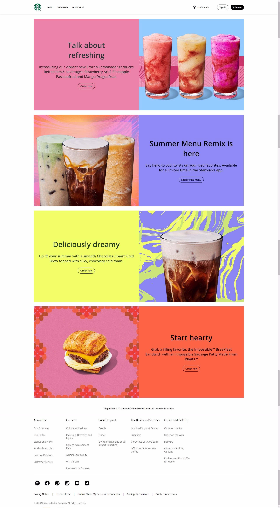
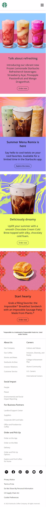

# Starbucks Main Page Clone

### Description
I have tried to clone main page of starbucks.com, I've used SCSS and Flexbox in this project. And I tried to apply responsive design with mobile hamburger menu (Note: while i was creating hamburger menu, I just used only css no js).

#### Live Site
- https://starbucks-main-page-clone.netlify.app/

## Built with

### HTML5
- Semantic HTML

### CSS
- SCSS
- Flexbox

## Preview

### Hamburger Menu w/ only CSS

.

### Desktop Preview

.

### Mobile Preview

.